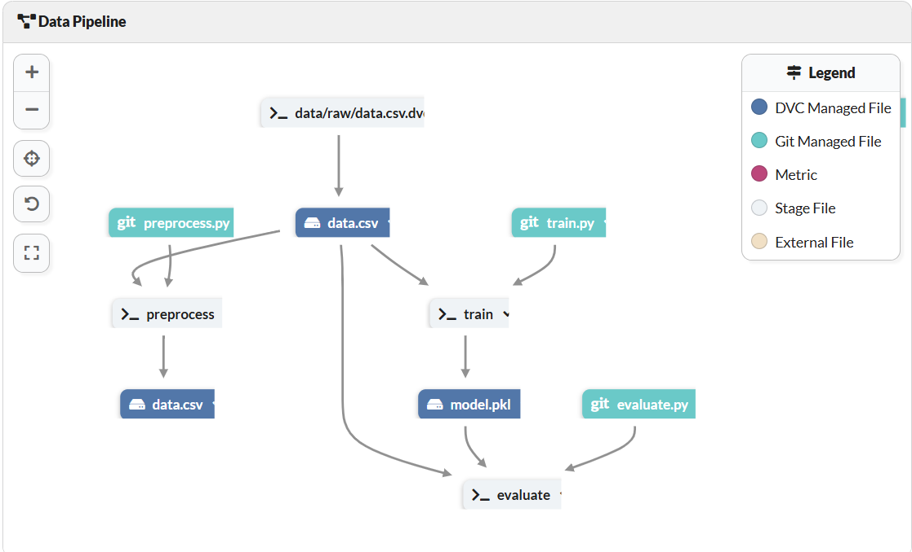

# End-to-End Machine Learning Pipeline with DVC, MLflow, and DagsHub

This project demonstrates the construction of an end-to-end machine learning pipeline utilizing **DVC (Data Version Control)** for data and model versioning, **MLflow** for experiment tracking, and **DagsHub** as the central platform for repository management. The pipeline is designed to train a Random Forest Classifier on the Pima Indians Diabetes Dataset, encompassing stages for data preprocessing, model training, and evaluation.

## Project Overview

This project showcases ways for managing the machine learning lifecycle, emphasizing reproducibility, experiment tracking, and collaborative workflows.

### Pipeline Overview

The diagram below illustrates the data pipeline implemented in this project:

### Project Features

#### Data Version Control with DVC

- **Versioning:** DVC tracks datasets, models, and pipeline stages, ensuring reproducibility across different environments.
- **Pipeline Management:** The pipeline is organized into stages—preprocessing, training, and evaluation—that are automatically re-executed upon any changes in dependencies (e.g., data, scripts, or parameters).
- **Remote Storage:** DVC integrates with remote storage solutions, such as DagsHub, for managing large datasets and models.

#### Experiment Tracking with MLflow

- **Logging:** MLflow records experiment parameters, metrics, and artifacts systematically.
- **Comparison:** Facilitates easy comparison across multiple experiments to optimize the machine learning pipeline.
- **Model Registry:** Stores trained models and their parameters, enabling straightforward performance comparisons.

#### Repository Management with DagsHub

- **Integration:** DagsHub seamlessly integrates with DVC and MLflow, providing a unified platform for version control, data management, and experiment tracking.
- **Visualization:** Offers interactive dashboards for visualizing experiment metrics and comparing model performance.
- **Collaboration:** Enhances team collaboration by providing access controls and shared repositories.

### Pipeline Stages

#### 1. Data Preprocessing

- **Script:** `src/preprocess.py`
- **Input:** Raw dataset (`data/raw/data.csv`)
- **Output:** Processed dataset (`data/processed/data.csv`)

This stage ensures consistent data preprocessing across runs, including tasks such as renaming columns and handling missing values.

#### 2. Model Training

- **Script:** `src/train.py`
- **Input:** Processed data
- **Output:** Trained model (`models/model.pkl`)

In this stage, a Random Forest Classifier is trained using scikit-learn. Hyperparameters and the model itself are logged into MLflow for tracking and comparison.

#### 3. Model Evaluation

- **Script:** `src/evaluate.py`
- **Inputs:** Trained model (`models/model.pkl`), processed dataset (`data/processed/data.csv`)
- **Outputs:** Evaluation metrics logged via MLflow

This stage evaluates the trained model's performance, providing insights into its accuracy and effectiveness.

### Key Benefits

- **Reproducibility:** Versioned data, code, and models enable reliable and consistent experiments.
- **Experimentation:** MLflow simplifies tracking, logging, and comparing various model training experiments and their hyperparameters.
- **Collaboration:** DagsHub's integration facilitates seamless teamwork and version management.

### Use Cases

- **Data Science Teams:** Ideal for teams collaborating on machine learning projects requiring rigorous version control and experiment tracking.
- **Machine Learning Research:** Suitable for researchers needing to manage datasets, track experiments, and reproduce results effectively.

### Technology Stack

| Technology   | Usage                                          |
|--------------|------------------------------------------------|
| DVC          | Data and model versioning                      |
| MLflow       | Experiment tracking and artifact logging       |
| DagsHub      | Repository management and collaboration        |
| Scikit-learn | Model development (Random Forest)              |
| Python       | Pipeline scripting and implementation          |

### DVC Pipeline Commands

To reproduce and manage pipeline stages, execute:

**Preprocessing Stage:**
dvc stage add -n preprocess \
    -p preprocess \
    -d src/preprocess.py -d data/raw/data.csv \
    -o data/processed/data.csv \
    python src/preprocess.py

**Training Stage:**

dvc stage add -n train \
    -p train \
    -d src/train.py -d data/processed/data.csv \
    -o models/model.pkl \
    python src/train.py

**Evaluation Stage:**

dvc stage add -n evaluate \
    -p evaluate \
    -d src/evaluate.py -d models/model.pkl -d data/processed/data.csv \
    python src/evaluate.py

### Utilizing DagsHub for Enhanced Collaboration

This project leverages DagsHub for integrated data management and experiment tracking:

- **Repository::** The project's repository is hosted on DagsHub, providing a centralized platform for code, data, and experiments.
- **MLflow Integration:**  DagsHub offers a built-in MLflow tracking server, allowing for seamless logging and visualization of experiment metrics.